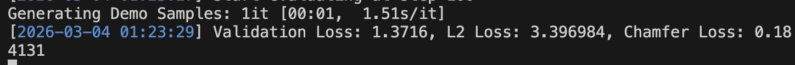

support dataset
- [x] single shape overfitting
- [x] single shape, multiple meshes (dummy)
- [x] shapenet
- [ ] objaverse 
- [x] sketchfab (305972/770)

support model
- [x] MeshFlow: EquiDiT(no PE) / unordered meshes
- [x] DiT+Rope  / ordered meshes


support generative modeling
- [x] V-prediction + V-loss
- [ ] x-prediction + V-loss

support coupling
- [x] OT coupling
- [x] independent coupling

Default Model Size = 500M (24 layers+16 heads+1024 hidden dims)


## Quick start
```bash
bash tools/run_train.sh configs/overfit/base-500m.yaml
bash tools/run_train.sh configs/overfit/base-120m.yaml
bash tools/run_train.sh configs/overfit/base-120m-ot.yaml
bash tools/run_train.sh configs/overfit/base-120m-x1.yaml


bash tools/run_train.sh configs/rebuttal/base-120m-x1.yaml
```
----
# MeshFlow
MeshFlow based on lightingDiT.
### TODO
- [x] clean code
- [x] simple train & test
- [x] implement jit
- [x] DDP for single-node multi-card training (test error in evaluation, fixed)
- [ ] dynamic allocator
- [x] prepare shapenet dataset (full)
- [x] prepare objaverse dataset

### Environment
```bash
conda create -n mflow python=3.10 -y
conda activate mflow

pip install torch==2.4.1 torchvision==0.19.1 torchaudio==2.4.1 --index-url https://download.pytorch.org/whl/cu124

# flash attention
pip install https://github.com/Dao-AILab/flash-attention/releases/download/v2.6.3/flash_attn-2.6.3+cu123torch2.4cxx11abiFALSE-cp310-cp310-linux_x86_64.whl

pip install -r requirements.txt

# if you encounter errors..
conda install nvidia/label/main::cuda-nvcc
conda install nvidia/label/main::cuda-toolkit

cd utils/chamfer3D
python setup.py install
cd ../..
```


### dataset
```bash
mkdir downloaded_data
cd downloaded_data
wget https://huggingface.co/datasets/qsun2001/omg/resolve/main/obj_data/dummy.tar.gz # or objaverse
tar xf dummy.tar.gz
rm dummy.tar.gz

wget https://huggingface.co/datasets/qsun2001/omg/resolve/main/obj_data/ss_overfit.tar.gz # or objaverse
tar xf ss_overfit.tar.gz
rm ss_overfit.tar.gz


wget https://huggingface.co/datasets/qsun2001/omg/resolve/main/obj_data/shapenet.tar.gz # or objaverse
tar xf shapenet.tar.gz
rm shapenet.tar.gz

# sketchfab converted mesh dataset
wget https://huggingface.co/datasets/qsun2001/omg/resolve/main/obj_data/sketchfab.tar.gz
tar xf sketchfab.tar.gz
rm sketchfab.tar.gz

wget https://huggingface.co/datasets/qsun2001/omg/resolve/main/obj_data/objaverse_occ_v5_ids.tar.gz 
wget https://huggingface.co/datasets/qsun2001/omg/resolve/main/obj_data/split.tar.gz
tar xf objaverse_occ_v5_ids.tar.gz
rm objaverse_occ_v5_ids.tar.gz
tar xf split.tar.gz
rm split.tar.gz
mkdir objaverse
mv objaverse_occ_v5_ids objaverse
mv split objaverse

wget https://huggingface.co/datasets/qsun2001/omg/resolve/main/obj_data/shapenet-cls.tar.gz
tar xf shapenet-cls.tar.gz
rm shapenet-cls.tar.gz

wget https://huggingface.co/datasets/qsun2001/omg/resolve/main/obj_data/shapenet-rebuttal2.tar.gz
tar xf shapenet-rebuttal2.tar.gz

wget https://huggingface.co/datasets/qsun2001/omg/resolve/main/obj_data/shapenet-rebuttal.tar.gz
tar xf shapenet-rebuttal.tar.gz

cd ..
```
Then you should modify the `configs/vae.yaml`.

### Train MeshFlow-1
```bash
bash tools/run_train.sh configs/base.yaml
```

### Train Latent MeshFlow
```bash
# change the 
bash tools/run_train_latent.sh  configs/latent.yaml

CUDA_VISIBLE_DEVICES=6, \
accelerate launch eval_ldm.py \
  --config configs/latent.yaml \
  --ckpt output/ldm/checkpoints/0070000.pt \
  --out_dir output/ldm \
  --use_ema \
  --batch_size 4
```

### Train VAE & Evaluate VAE
```
# train auto-encoder
bash tools/run_trainvae.sh configs/vae.yaml # regression loss
bash tools/run_trainvae.sh configs/vae_cls.yaml # classification loss

# eval auto-encoder (L1 loss)
mkdir -p output/vae_rms_lamp/checkpoints
cd output/vae_rms_lamp/checkpoints
wget https://huggingface.co/datasets/qsun2001/omg/resolve/main/vae_ckpts_1e-3/0036000.pt
# wget https://huggingface.co/datasets/qsun2001/omg/resolve/main/vae_ckpts/0130000.pt
cd ../../..

CUDA_VISIBLE_DEVICES=0, \
accelerate launch eval_vae.py \
  --config configs/vae_ch2_1e-2.yaml \
  --checkpoint output/vae_rms_lamp_ch2/checkpoints/0093000.pt \
  --output_dir output/vae_rms_lamp_ch2/eval_samples \
  --num_save 40

# noisy mesh is in output/vae_rms_lamp_ch2/eval_samples
```

### Run JIT on dummy
```bash
# training
bash tools/run_train.sh configs/base_jit.yaml
CUDA_VISIBLE_DEVICES=6, python train_pixel_single.py --config configs/base_jit.yaml
```

### Extract feature
```bash
cd third_party/PartField
CUDA_VISIBLE_DEVICES=6, python partfield_inference.py -c configs/final/demo.yaml --opts continue_ckpt model/model_objaverse.ckpt result_name partfield_features/objaverse dataset.data_path ../../downloaded_data/dummy/objaverse_occ_v5_ids

cd ../..
python tools/merge_feature.py
bash tools/run_train_421a.sh configs/base.yaml
```

### post-processing
```bash

python post_mesh.py \
  --config configs/vae_fixed_500m.yaml \
  --checkpoint ./output/vae_rms_fixed_002_mse_scale_500m/checkpoints/0021000.pt \
  --input_folder output/post/002_noise_valid \
  --output_dir output/post/check_test_500m

python post_mesh.py \
  --config configs/vae_fixed_500m_bench.yaml \
  --checkpoint ./output/vae_rms_fixed_002_mse_scale_500m_02828884/checkpoints/0021000.pt \
  --input_folder output/post/49_steps_bench \
  --output_dir output/post/preprocess_49_steps_bench
```

### EquiDiT mesh inference (sample .obj)

`tools/infer_mesh_equidit.py` is a standalone sampling script for mesh EquiDiT checkpoints.
It loads model config + checkpoint, runs ODE sampling, saves generated meshes as `.obj`,
can follow the test-set face count for each sample, saves GT test meshes, and automatically
computes point-based metrics with [tools/point_evaluation.py](tools/point_evaluation.py).

Recommended example: sample using test-set face counts and automatically evaluate against GT.

```bash
python tools/infer_mesh_equidit.py \
  --config /data1/sunqi/MeshFlow2/configs/rebuttal/base-120m-x1.yaml \
  --ckpt output/rebuttal-120m-x1-02933112/checkpoints/00750000.pt \
  --out-dir output/rebuttal-120m-x1-02933112/infer_00750000_eval \
  --num-samples 100 \
  --batch-size 16 \
  --use-test-faces
```

If you really want fixed-length sampling, you can still use `--num-faces`, but for evaluation
against the test set the recommended mode is `--use-test-faces`.

Notes:

- If you run from project root, do not omit `tools/` in script path.
- By default, `--use-test-faces` reads the validation/test split from `data.data_path` in the config.
- `--test-data-path` is only an override if you want to evaluate on another dataset root.
- `--use-test-faces` makes the script sample each mesh with its own GT validation/test face count instead of always using `800`.
- The saved GT meshes come from that same validation/test split source, i.e. the same dataset root used by the script.
- In `--use-test-faces` mode, the script also saves GT meshes to `--out-dir/gt_test_mesh`.
- In `--use-test-faces` mode, the script automatically computes and saves point metrics to `--out-dir/point_metrics.json`.
- Metrics include `JSD`, `lgan_mmd-CD`, `lgan_cov-CD`, `lgan_mmd_smp-CD`, `1-NN-CD-acc`, `1-NN-CD-acc_t`, `1-NN-CD-acc_f`.
- Optional args: `--cfg-scale`, `--num-steps`, `--max-val`, `--eval-batch-size`, `--eval-num-points`.

Optional override example:

```bash
conda run -n mflow env PYTHONPATH=/data1/sunqi/MeshFlow2 \
python /data1/sunqi/MeshFlow2/tools/infer_mesh_equidit.py \
  --config /data1/sunqi/MeshFlow2/configs/rebuttal/base-120m-x1.yaml \
  --ckpt /data1/sunqi/MeshFlow2/output/rebuttal-120m-x1-02808440/checkpoints/00255000.pt \
  --out-dir /data1/sunqi/MeshFlow2/output/rebuttal-120m-x1-02808440/infer_00255000_eval \
  --num-samples 100 \
  --batch-size 16 \
  --use-test-faces \
  --test-data-path /data1/sunqi/MeshFlow2/downloaded_data/shapenet-02876657
```


### MeshFlow + Denoiser

1. download meshflow data
```bash 
mkdir -p downloaded_data/meshflow_data
cd downloaded_data/meshflow_data
wget https://huggingface.co/datasets/qsun2001/omg/resolve/main/meshflow/49_steps_chair.zip
wget https://huggingface.co/datasets/qsun2001/omg/resolve/main/meshflow/49_steps_table.zip
unzip 49_steps_chair.zip
unzip 49_steps_table.zip
cd ../..
```

2. download checkpoint
```bash 
mkdir -p downloaded_data/denoiser_ckpt/chair_500m
cd downloaded_data/denoiser_ckpt/chair_500m
wget https://huggingface.co/datasets/qsun2001/omg/resolve/main/denoiser/002_500M_chair/0030000.pt
cd ../../..

mkdir -p downloaded_data/denoiser_ckpt/bench_500m
cd downloaded_data/denoiser_ckpt/bench_500m
wget https://huggingface.co/datasets/qsun2001/omg/resolve/main/denoiser/002_500M_bench/0021000.pt
cd ../../..

mkdir -p downloaded_data/denoiser_ckpt/lamp_500m
cd downloaded_data/denoiser_ckpt/lamp_500m
wget https://huggingface.co/datasets/qsun2001/omg/resolve/main/denoiser/002_500M_lamp/0009000.pt
cd ../../..

mkdir -p downloaded_data/denoiser_ckpt/table_500m
cd downloaded_data/denoiser_ckpt/table_500m
wget https://huggingface.co/datasets/qsun2001/omg/resolve/main/denoiser/002_500M_table/0063000.pt
cd ../../..

```

3. run denoiser

```bash
python post_mesh.py \
  --config configs/vae_fixed_500m_chair.yaml \ #
  --checkpoint ./downloaded_data/denoiser_ckpt/chair_500m/0030000.pt \
  --input_folder downloaded_data/meshflow_data/49_steps_chair \
  --output_dir output/post_process/chair

cat=chair
python post_mesh.py \
  --config configs/vae_fixed_500m_${cat}.yaml \
  --checkpoint ./downloaded_data/denoiser_ckpt/chair_500m/0030000.pt \
  --input_folder ./downloaded_data/pretrained/chair/iter490000/eval_nsteps50_nsmp1000infer_cfg1.0 \
  --output_dir output/post_process/chair_sota_1-2

cat=table
python post_mesh.py \
  --config configs/vae_fixed_500m_${cat}.yaml \
  --checkpoint ./downloaded_data/denoiser_ckpt/${cat}_500m/0063000.pt \
  --input_folder ./downloaded_data/pretrained/table/iter490000/eval_nsteps200_nsmp1000infer_cfg6.0 \
  # --output_dir output/post_process/table_2-1

cat=lamp
python post_mesh.py \
  --config configs/vae_fixed_500m_${cat}.yaml \
  --checkpoint ./downloaded_data/denoiser_ckpt/${cat}_500m/0009000.pt \
  --input_folder ./downloaded_data/pretrained/lamp/iter346000/49steps_cfg1 \
  --output_dir output/post_process/lamp_1


cat=bench
python post_mesh.py \
  --config configs/vae_fixed_500m_${cat}.yaml \
  --checkpoint ./downloaded_data/denoiser_ckpt/${cat}_500m/0021000.pt \
  --input_folder ./downloaded_data/pretrained/bench/iter446000/eval_nsteps250_nsmp1000infer_cfg1.0 \
  --output_dir output/post_process/bench_sota_1

```