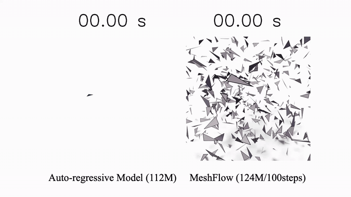

# MeshFlow: Mesh Generation with Equivariant Flow Matching

This repository contains a PyTorch implementation of **MeshFlow: Mesh Generation with Equivariant Flow Matching** (SIGGRAPH 2026).

Qi Sun, [Kiyohiro Nakayama](https://georgenakayama.github.io/), [Jing Nathan Yan](https://nathanyanjing.github.io/), [Qixing Huang](https://www.cs.utexas.edu/~huangqx/), [Alexander Rush](https://rush-nlp.com/), [Leonidas Guibas](https://geometry.stanford.edu/member/guibas/), [Gordon Wetzstein](https://stanford.edu/~gordonwz/), [Jing Liao](https://scholar.google.com/citations?user=3s9f9VIAAAAJ&hl=zh-CN), and [Guandao Yang](https://www.guandaoyang.com/)



## Introduction

MeshFlow is an unconditional mesh generation pipeline based on equivariant flow matching. This repository is trimmed to the core training, inference, and evaluation code used for mesh generation experiments.

Main entry points:

- Training: `train.py`
- Inference: `inference.py`
- Train launcher: `tools/run_train.sh`
- Chamfer curve evaluation: `tools/plot_chamfer_vs_steps.py`
- ShapeNet generation metrics: `tools/point_evaluation.py`
- Flow matching core: `flow_matching.py`

## Dependencies

The code is tested with Python 3.10, PyTorch 2.4.1, CUDA 12.4, and FlashAttention 2.6.3.

```bash
conda create -n mflow python=3.10 -y
conda activate mflow
pip install torch==2.4.1 torchvision==0.19.1 torchaudio==2.4.1 --index-url https://download.pytorch.org/whl/cu124
pip install https://github.com/Dao-AILab/flash-attention/releases/download/v2.6.3/flash_attn-2.6.3+cu123torch2.4cxx11abiFALSE-cp310-cp310-linux_x86_64.whl
pip install -r requirements.txt
```

Optional Chamfer extension:

```bash
cd utils/chamfer3D
python setup.py install
cd ../..
```

## Dataset

Run all dataset commands from the repository root.

```bash
mkdir -p downloaded_data
cd downloaded_data
```

Required for overfit configs:

```bash
wget https://huggingface.co/datasets/qsun2001/omg/resolve/main/obj_data/ss_overfit.tar.gz
tar xf ss_overfit.tar.gz
rm ss_overfit.tar.gz
```

Optional datasets for ShapeNet and larger experiments:

```bash
# sketchfab
wget https://huggingface.co/datasets/qsun2001/omg/resolve/main/obj_data/sketchfab.tar.gz
tar xf sketchfab.tar.gz
rm sketchfab.tar.gz

# shapenet main split
wget https://huggingface.co/datasets/qsun2001/omg/resolve/main/obj_data/shapenet.tar.gz
tar xf shapenet.tar.gz
rm shapenet.tar.gz

# shapenet class split
wget https://huggingface.co/datasets/qsun2001/omg/resolve/main/obj_data/shapenet-cls.tar.gz
tar xf shapenet-cls.tar.gz
rm shapenet-cls.tar.gz

# shapenet rebuttal splits
wget https://huggingface.co/datasets/qsun2001/omg/resolve/main/obj_data/shapenet-rebuttal.tar.gz
tar xf shapenet-rebuttal.tar.gz
rm shapenet-rebuttal.tar.gz

wget https://huggingface.co/datasets/qsun2001/omg/resolve/main/obj_data/shapenet-rebuttal2.tar.gz
tar xf shapenet-rebuttal2.tar.gz
rm shapenet-rebuttal2.tar.gz

# objaverse assets
wget https://huggingface.co/datasets/qsun2001/omg/resolve/main/obj_data/objaverse_occ_v5_ids.tar.gz
wget https://huggingface.co/datasets/qsun2001/omg/resolve/main/obj_data/split.tar.gz
tar xf objaverse_occ_v5_ids.tar.gz
tar xf split.tar.gz
rm objaverse_occ_v5_ids.tar.gz
rm split.tar.gz
mkdir -p objaverse
mv objaverse_occ_v5_ids objaverse/
mv split objaverse/
```

Back to the repository root:

```bash
cd ..
```

Expected overfit dataset layout:

```text
downloaded_data/ss_overfit/
  split/
    train.npz
    test.npz
  objaverse_occ_v5_ids/
    *.npz
```

## Training

Overfit example:

```bash
bash tools/run_train.sh configs/overfit/base-120m-ot-x1.yaml --train.global_batch_size=4
```

ShapeNet category example:

```bash
bash tools/run_train.sh configs/snet/base-120m-x1-bench.yaml
```

Long-running ShapeNet bench example with command-line overrides:

```bash
accelerate launch \
  --num_processes 6 \
  --mixed_precision bf16 \
  --gpu_ids 0,1,2,3,4,5 \
  train.py \
  --config configs/snet/base-120m-ot-v-bench.yaml \
  train.global_batch_size=72 \
  train.max_steps=1000000 \
  train.ckpt_every=50000
```

Training automatically saves checkpoints under `output/<exp_name>/checkpoints` and keeps the latest 3 checkpoints by default. At the end of training, final inference is enabled by default and generates `train.final_num_samples` meshes, defaulting to 1000.

## Inference

Standalone inference example:

```bash
python inference.py \
  --config configs/overfit/base-120m-x1.yaml \
  --ckpt_path output/overfit-base-120m-x1/checkpoints/00075000.pt \
  --demo
```

ShapeNet bench inference example:

```bash
CUDA_VISIBLE_DEVICES=6 python inference.py \
  --config configs/snet/base-120m-ot-v-bench.yaml \
  --ckpt_path output/120m-ot-v-bench/checkpoints/00500000.pt \
  sample.num_samples=1000
```

Generated meshes are saved to `output/<exp_name>/infer_<step>/`. The default CFG scale is 2.0 and can be overridden with `sample.cfg_scale=<value>`.

## Gradio Demo

Launch an interactive web demo for category-conditioned single-mesh generation and post-processing (merge vertices + hole filling):

```bash
python gradio_demo.py \
  --config configs/snet/base-120m-ot-v-bench.yaml \
  --port 7860
```

Then open `http://127.0.0.1:7860` in your browser.

In the UI you can control:

- category mode with 4 options: `bench`, `chair`, `lamp`, `table`
- one dedicated 1M checkpoint path for each category (auto-switched by category)
- random seed, CFG scale, sampling steps, face count
- merge exact duplicate vertices
- merge close vertices with a distance tolerance
- fill mesh holes with an optional max-hole-size limit

Each run exports both `raw.obj` and `post.obj` under `output/gradio_demo/<timestamp>/`.

## Evaluation

ShapeNet generation metrics can be computed from generated `.obj` meshes:

```bash
CUDA_VISIBLE_DEVICES=6 python tools/point_evaluation.py \
  --gen-root output/120m-ot-v-bench/infer_00500000 \
  --category bench
```

Run repeated evaluations and report mean/std metrics:

```bash
CUDA_VISIBLE_DEVICES=6 python tools/point_evaluation.py \
  --gen-root output/120m-ot-v-bench/infer_00500000 \
  --category bench \
  --num-runs 5
```

Supported category names include `bench`, `bottle`, `chair`, `display`, `monitor`, `lamp`, `loudspeaker`, `speaker`, and `table`. If `--max-gen-meshes` is omitted, evaluation defaults to the number of valid test meshes for the requested category.

## Repository Structure

```text
configs/
  overfit/
  snet/
datasets/
models/
tools/
  run_train.sh
  plot_chamfer_vs_steps.py
  point_evaluation.py
utils/
flow_matching.py
inference.py
train.py
```

## Cite

Please cite our work if you find it useful:

```bibtex
@inproceedings{meshflow,
  title     = {MeshFlow: Mesh Generation with Equivariant Flow Matching},
  author    = {Sun, Qi and Nakayama, Kiyohiro and Yan, Jing Nathan and Huang, Qixing and Rush, Alexander and Guibas, Leonidas and Wetzstein, Gordon and Liao, Jing and Yang, Guandao},
  booktitle = {SIGGRAPH},
  year      = {2026}
}
```